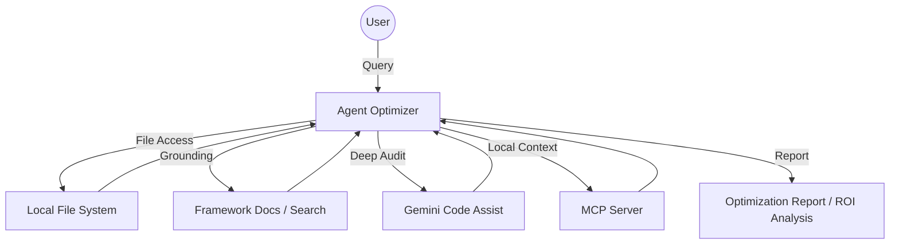

# Agent Optimizer & Evaluation Agent

An intelligent assistant built with the [Google Agent Development Kit (ADK)](https://google.github.io/adk-docs/) to analyze, optimize, and evaluate AI agents across all major frameworks. It leverages context engineering principles and multi-library intelligence to help developers build production-ready, cost-efficient agents.

<table>
  <thead>
    <tr>
      <th colspan="2">Key Features</th>
    </tr>
  </thead>
  <tbody>
    <tr>
      <td>🧪</td>
      <td><strong>FinOps Principal:</strong> Activates the "Engineered for Margin" persona to maximize <strong>Reasoning Density</strong>.</td>
    </tr>
    <tr>
      <td>🛠️</td>
      <td><strong>Auto-Remediation:</strong> Automatically injects <strong>ContextCacheConfig</strong>, <strong>EventsCompactionConfig</strong>, and resiliency patterns across codebases.</td>
    </tr>
    <tr>
      <td>🚄</td>
      <td><strong>AST Efficiency Scan:</strong> Scans code for model routing waste and missing caching layers (up to 90% cost reduction).</td>
    </tr>
    <tr>
      <td>📚</td>
      <td><strong>Multi-Framework IQ:</strong> Dynamically ingests documentation for <strong>ADK, CrewAI, LangGraph, OpenAI AgentKit, AG2, Pydantic AI, LlamaIndex,</strong> and more.</td>
    </tr>
    <tr>
      <td>🧗</td>
      <td><strong>Hill Climbing:</strong> Benchmarks agents against golden datasets to find the optimal cost-performance "Sweet Spot."</td>
    </tr>
    <tr>
      <td>🏗️</td>
      <td><strong>Production-Ready:</strong> Deploy to <a href="https://cloud.google.com/vertex-ai/generative-ai/docs/agent-engine/overview">Vertex AI Agent Engine</a> via <a href="https://goo.gle/agent-starter-pack">Agent Starter Pack</a>.</td>
    </tr>
  </tbody>
</table>

## What It Does

The Agent Optimizer serves as a "Super-Developer" sidekick that:
- **Audits Multi-Framework Codebases**: Scans directories for **ADK, CrewAI, LangGraph, AutoGen (AG2), LlamaIndex,** and **Pydantic AI** to find inefficiencies.
- **Engineered for Margin**: Optimizes model routing (Pro vs. Flash) to reduce TCO by up to 70%.
- **AST-Based Remediation**: Automatically injects **ContextCacheConfig**, **EventsCompactionConfig**, and resiliency decorators.
- **Reasoning Density Metric**: Maximizes the ratio of task completion quality over token expenditure.

---

## Getting Started

### Prerequisites
- **Python 3.10+**
- **Google Cloud Project** with Vertex AI enabled
- **ADK installed**: `pip install google-adk`

### Local Setup

1. **Clone & Install**:
   ```bash
   git clone https://github.com/google/adk-samples.git
   cd adk-samples/python/agents/agent-optimizer
   make install
   ```

2. **Configure Environment**:
   Create a `.env` file from the example:
   ```bash
   cp .env.example .env
   # Add your GOOGLE_CLOUD_PROJECT and GOOGLE_CLOUD_LOCATION
   ```

3. **Run a Quick Analysis**:
   ```bash
   adk run --input="Analyze the CrewAI agent in ./my-agent and optimize for memory."
   ```

---

### 🚀 One-Command Setup (via Agent Starter Pack)

The fastest way to get a production-ready instance of this agent is through the [Agent Starter Pack (ASP)](https://goo.gle/agent-starter-pack):

```bash
uvx agent-starter-pack create my-optimizer -a adk@agent-optimizer
```

---

## 🏛️ Economic Lifecycle Commands

The FinOps Principal persona utilizes specialized commands to identify and patch "Margin Bleed" across your agent fleet:

| Command | Objective | Impact | Technical Implementation |
| :--- | :--- | :--- | :--- |
| `make optimizer-audit` | **Token Efficiency Scan** | Scans code for model routing waste and missing caching layers. | Uses `ast` to detect large prompt constants and `router` patterns. |
| `make arch-review` | **Strategic Pivot Audit** | Recommends structural shifts (e.g., GPT-4 to Gemma2) to maximize ROI. | `PivotAuditor` heuristics for model-compute-protocol alignment. |
| `make audit-deep` | **Master Optimization Audit** | Runs "Hill Climbing" benchmarks to find the optimal curve. | Executes `quality_climber.py` against golden datasets. |
| `make apply-fixes` | **Auto-Remediation** | Triggers the `CodeRemediator` to inject caching and compaction. | `CodeRemediator` AST injection of `@retry` and `ContextCacheConfig`. |

---

## 📉 FinOps Optimization Pillars

The Agent Optimizer evaluates your codebase across three primary economic pillars:

### 1. 🚄 Context Caching (The 90% Win)
*   **Vector**: Detecting large, static system prompts or RAG contexts that are re-sent in every request.
*   **Impact**: Recommends **Vertex AI CachingConfig** to reduce costs by up to 90% for repeated prefixes.

### 🔄 Smart Model Routing
*   **Vector**: Identifying "Over-Modeling"—using high-tier models (Pro/Omni) for low-complexity tasks like summarization or classification.
*   **Impact**: Recommends routing logic to **Gemini 1.5 Flash** or **Gemma 2** for non-reasoning sub-tasks.

### 🧠 Semantic Caching (Hive Mind)
*   **Vector**: Detecting redundant identical queries being processed by the LLM.
*   **Impact**: Recommends the `@hive_mind` decorator and centralized caching to avoid re-billing for previously computed results.

---

## Example Prompts (FinOps Focus)


| Use Case | Example Prompt |
| :--- | :--- |
| **Token Optimization** | "Audit the **LangGraph** workflow in `./graph-agent/`. Detect raw token waste and missing caching layers." |
| **Auto-Remediation** | "Apply all FinOps optimization fixes to my agent in `./customer-service-agent/` using `apply_fixes`." |
| **Cost Efficiency** | "How can I use **ADK's ContextCacheConfig** to reduce prefix costs by 90% in my **OpenAI AgentKit** logic?" |
| **Hill Climbing** | "Execute a deep optimization audit against `golden_set.json` to find the Reasoning Density peak." |
| **Strategic Pivot** | "Analyze my stack and recommend a pivot for switching from Cloud Run to GKE for better ROI." |
| **Architecture Audit** | "Perform an `arch_review` of my current model alignment. Am I over-modeling simple sub-tasks?" |

---

## Agent Preview

<p align="center">
  
</p>

---

## Architecture



## Agent Details

| Attribute | Description |
| :--- | :--- |
| **Interaction Type** | Reactive / Expert Efficiency Advisor |
| **Frameworks Supported** | ADK, CrewAI, LangGraph, LangChain, OpenAI AgentKit, AG2, Pydantic AI, LlamaIndex, AutoGen |
| **Agent Type** | Single Agent with Efficiency Toolset |
| **Components** | Resource Analyzer, Framework Search, Code Assist Bridge, Artifact Service |
| **Vertical** | Developer Tools / AI Orchestration / Cost Optimization |

## Model Configuration

| Component | Model | Notes |
| :--- | :--- | :--- |
| **Optimization Engine** | `gemini-2.0-flash` | **Default** - Latest ultra-high-speed model with 1M context. |
| **Reasoning & Planning** | `gemini-2.0-pro-exp` | Experimental multimodal reasoning model for extreme planning. |
| **Code Review** | `gemini-code-assist` | Utilized through the Code Assist Bridge tool for deep audits. |

## Deployment

### Deploy to Vertex AI Agent Engine
The quickest way to deploy is using the pre-configured `Makefile`:
```bash
make deploy
```

### Register in Gemini Enterprise
You can register your agent directly using the Agent Starter Pack (ASP):
```bash
uvx agent-starter-pack register-gemini-enterprise
```

## License
Copyright 2026 Google LLC. Licensed under the Apache License, Version 2.0.
